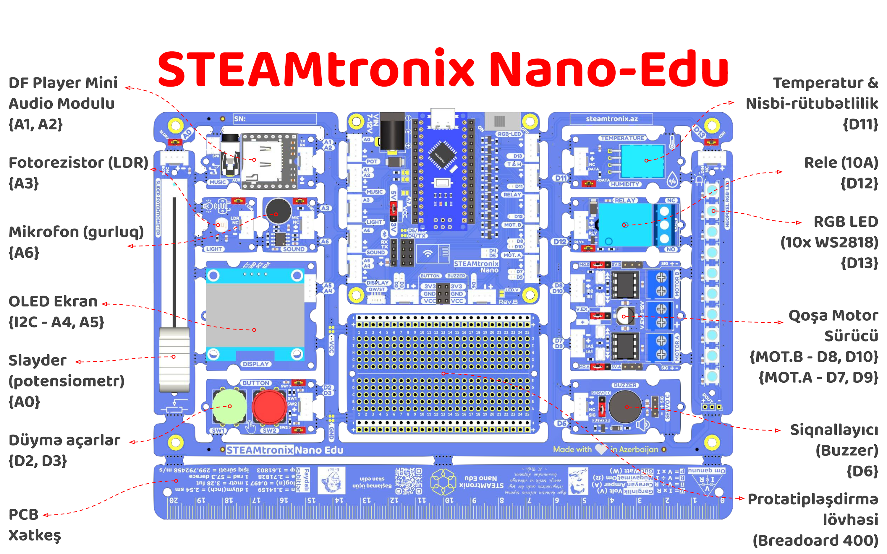

# Nano-Edu

## Giriş


SteamtroniX dövrə kartları STEAM və Robototexnika tədrisində elektronikanın tətbiqini daha da asanlaşdıraraq tələbə və şagirdlərə hamısı-birində olan çoxfunksiyalı dövrə kartları təqdim edir. Bu seriyanın ilk məhsulu olan Nano-Edu dəsti 12 müxtəlif modulu və əlavə çoxlu faydalı funksionallığı özündə birləşdirir. Bu funksionallıqlara WiFi, Bluetooth əlavəsi imkanı, üzərində protatipləşdirmə lövhəsi/breadboard olması, çoxsaylı sensor interfeysi, genişləndirmə imkanları və s. daxildir.


## Əsas xüsusiyyətləri

- Qida gərginliyi: 7-12V (maks. 18V)
- İşçi gərginliyi: 5V / 3.3V
- Kartın ölçüləri: 210 x 180 x 33 mm

## Dəstə nələr daxildir

- Nano-Edu dövrə kartı
- Arduino Nano V3 (Type-C girişli)
- Type-C USB kabel
- 6 əd. Grove 20sm 4 pinli əlaqə kabelli konnektorlar
- 2 əd. Grove 20sm 4 pinli iynə uclu kabel konnektorlar

## Faydalı keçidlər
- [Təqdimat videosu]()
- [Nümunə kodları endir](https://github.com/steamtronix/nano-edu)
- [Arduino kitabxanalarını endir](https://github.com/steamtronix/nano-edu)
- [Dövrə sxemi (Rev.A)](https://github.com/steamtronix/nano-edu/blob/main/hardware/nano-edu-sch-bw.pdf)


## Platforma üzərindəki modullar


### Nano kontroller
Dəstəkləyən Nano modelləri:

- [Nano v3 (üzərində olan)](https://makerstore.az/product/maker-nano-v3-5v-type-c/)
- [Nano 33 IoT](https://makerstore.az/product/arduino-nano-33-iot/)
- [Nano 33 BLE Sense Rev2](https://makerstore.az/product/arduino-nano-33-ble-sense-rev2/)
- [Nano Every](https://store.arduino.cc/products/arduino-nano-every?queryID=undefined)
- [Nano ESP32](https://store.arduino.cc/en-fr/products/nano-esp32?queryID=undefined)


### Slayder potensiometr
Slayder (10K potensiometr) – A0

### Musiqi oxuyucu
DF player mini (mp3) audio oxuyucu modul – A2, A3

### İşıq sensoru (LDR)
İşıq sensoru (fotorezistor) – A3

### Səs gurluğu sensoru (mikrofon)
Səs sensoru (mikrofon) – A6

### 1.3" OLED ekran
OLED Ekran (I2C – A4, A5)

### Qoşa düymə açarlar
Düymə açarlar – D2, D3 (pull-up, açıq halda vəziyyəti 1(HIGH), qapalı 0(LOW))

### Passiv buzzer siqnallayıcı
Buzzer / Servo C – ~D6

### Qoşa Motor sürücü (H-körpü)
L9110 Qoşa Motor Sürücü – ~D9, D7, ~D10, D8

### Rele açar
Rele modulu – D12

### Temperatur və nəmlik sensoru

DHT11 Temperatur & N. Rütubətlilik – D11

### WS2812B proqramlanabilən Neopixel LEDlər

10 əd WS2812B Neopixel LEDlər – D13

### Simsiz əlaqə portu
ESP-01 / HC-06 – D4, D5 (modul özü daxil deyil)

### Protatipləşdirmə Kartı/Breadboard 400

## Pin diaqramı

## Nümunə Kodlar

### LED Blink nümunəsi

``` cpp linenums="1"
// the setup function runs once when you press reset or power the board
void setup() {
  // initialize digital pin LED_BUILTIN as an output.
  pinMode(LED_BUILTIN, OUTPUT);
}

// the loop function runs over and over again forever
void loop() {
  digitalWrite(LED_BUILTIN, HIGH);  // turn the LED on (HIGH is the voltage level)
  delay(1000);                      // wait for a second
  digitalWrite(LED_BUILTIN, LOW);   // turn the LED off by making the voltage LOW
  delay(1000);                      // wait for a second
}
```


